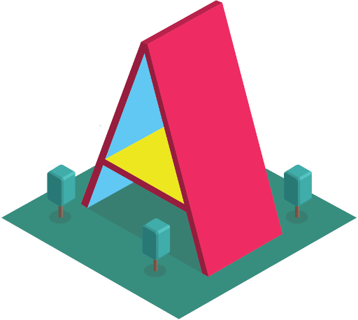

This was made during my time at Code Chrysalis

# glyphitti

Petraglyphs are the artistic remnants of ancient peoples. Be transported in front of Newspaper Rock in Arizona's Petrified Forest. Stamp a petraglyph identicial to one on the rock along the rock facing. Remember that just because you can doesn't mean you should.

## Getting Started

### Prerequisites




### Installing

1. Please fork our master repository.
2. Now clone your forked repository.

```
$ git clone https://github.com/{your user name}/glyphitti.git
```

2. Everytime we update, we want to make sure you have the latest version. So set up our master branch as upstream master.

```
$ git remote add upstream https://github.com/dejaviewdujour/gylphitti
```

3. Be sure to install your depencies with yarn install command.

```
$ yarn install
```

### Viewing

Want to view the app on your desktop? Run the following script.

```
$ yarn dev
```

If you want to view the latest version on your phone or headset, visit the latest deployment at:

https://glyphitti.herokuapp.com

## Deployment

1. Run yarn build

```
$ yarn build
```

2. Run yarn start

```
$ yarn start
```

## Known Issues

Stamps appear in cursor as well as click. Headset compatibility differs and needs to be mapped when entering VR.

## Contributing

When contributing to this repository, please first discuss the change you wish to make via issue,
email, or any other method with us.

## Authors

[**Ian McClerin**](https://github.com/dejaviewdujour)

## License

This project is licensed under the MIT License - see the [LICENSE](LICENSE) file for details
